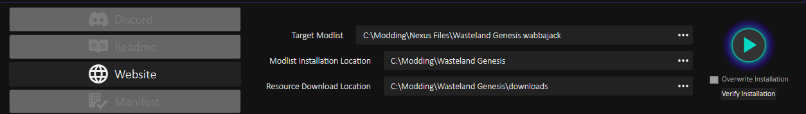

<h2 style="text-align: center">INSTALL READ ME</h2>

<h2>Table of Contents</h2>

[Requirements](#Requirements)

[PC Specs](#PC-specs)

[Install from Nexus](#Install-Steps---For-Nexus-downloaded-file)

[Install from Wabbajack](#Install-Steps---For-Wabbajack-downloaded-file)

[Manual files](#Manual-File-Downloads)

[Launching Wasteland Genesis](#Launching-Wasteland-Genesis)

<h2>Requirements</h2>

# **Creation Kit is a hard requirement - Make sure you have this first!** 

### The latest, Next Gen, version of Fallout 4 - 1.10.984

### This mod list works best if installed on a SSD.

### It will require 240 GB of space (the downloads can be deleted once it’s working to save space 74 GB).

### You need a clean & legal copy of Fallout 4 from Steam, as well as all DLC, EXCEPT the High Resolution Texture Pack

<h3>PC Specs</h3>

My PC Specs

GPU - NVidia RTX4060 Ti 16GB

CPU - Intel i7-9700K - 3.65 - 4.5GHz 

RAM - Corsair Vengeance LPX DDR4 - 2 x 8GB (16GB) 

Storage - 2TB Fanxiang S500 PRO

<h2>Install Steps - For Nexus downloaded file</h2>

<h4>Step 1 - Folder set-up (Optional Step)</h4>

_(This step is optional if you want to keep your file structure clean and don’t have your own method)_

Create a folder called “Modding” anywhere on your SSD, away from protected folders like Program Files

In this, create a folder called “Wasteland Genesis”

And create a folder called “Wabbajack”

And create a folder called “Nexus Files”.

My file structure looks like this

C:Modding

C:Modding\Nexus Files

C:Modding\Wabbajack

C:\Modding\Wasteland Genesis

<h4>Step 2 - Downloading Wasteland Genesis</h4>

<b>** From Nexus **</b>

Download Wasteland Genesis.zip

_(You can put this into your C:Modding\Nexus Files folder if you use the same structure as me)_

Unzip Wasteland Genesis.zip and save for later

The contents of your folder should look like this (Ignore Bodyslide I need to change the picture)

<h4>Step 3 - Download Wabbajack</h4>

You will also need to download and install Wabbajack from here [https://www.wabbajack.org/](https://www.wabbajack.org/)

Put the Wabbajack.exe into your Wabbajack folder

_(Note: I’ve already run Wabbajack.exe which is why I have the extra contents in this pic)_

<h4>Step 4 - Run Wabbajack</h4>

Open the Wabbajack file and select the Wabbajack.exe

<h4>Step 5 - Using Wabbajack</h4>

From the Welcome page select "Get Started" - The big pink box at the botto of the page!

This will take you to the next screen where you can select the install from disk option, which can be found in the top right of the screen

Under Target Modlist select the file “Wasteland Genesis.wabbajack” (not the .meta.json file) from the Nexus Folder that you created earlier.

On the next screen choose your file location on the left of the screen

The other 2 fields fill themselves out, but you can change them if you want

Then hit the install button

<h2>Install Steps - For Wabbajack downloaded file</h2>

<h5>Step 6 - Select Wasteland Genesis from the Wabbajack launcher</h5>

Then select install from file - the big pink box on the bottom left of the screem

On the next screen choose your file location on the left of the screen

<h2>Manual File Downloads</h2>

You will be prompted to manually download 2 files.

<h5>Step 7 - MiscHairStyle</h5>

Press the Blue download button and close any pop ups it opens.

<h5>Step 7.1 - OCBP body physics</h5>

🔴 ***The link takes you to Lovers Lab where there are porn pictures and it is strictly NSFW.***

You will also have to sign in.

If you don’t have an account you will have to make one, but it just requires an email and password.

The OCBP download page looks like this:

Select the download button for OCBP_3.1.2_CBBE.zip

This download often fails, so I will tell you how to download and install manually

<h4>Step 8 - Correcting OCBP download failure</h4>

The OCBP Manual file will probably fail

You will get an error for OCBP, via a web page link

This will flag an install failure on the Wabbajack UI as well.

_(Note: You may not get this error straight away, just wait for it to pop up)_

You can click the link on the web page to take you to the download page.

WARNING:

🔴 ***The link takes you to Lovers Lab where there are porn pictures and it is strictly NSFW.***

You will also have to sign in

If you don’t have an account you will have to make one, but it just requires an email and password

From the link, download 3.1.2_CBBE.zip (it’s the same page as before)

and drop into your Wasteland Genesis\Downloads folder

DO NOT unzip the archive file!

<h4>Step 9 - Continue with Installation</h4>

Your Wabbajack UI will look like this, so click the Main Menu button (with the left pointing arrow) in the bottom right section, that says Installation Failed and is flashing red

Then start the install process again (as per Step 5) and it will carry on where it left off. DO NOT select the Overwrite Installation check box or you will have to re-download everything!

All the original setting will be saved, so just press the ‘play’ button

<h4>Step 10 - Installation Complete</h4>

When Wasteland Genesis has completed, you should have a screen that looks like this

<h2>Launching Wasteland Genesis</h2>

<h4>Step 11 - Run Wasteland Genesis</h4>

Click on install folder and it will take you to the folder with all the mods, MO2 and other files needed to run this mod list

<h4>Step 12 - Run Mod Organizer</h4>

Now select Wasteland Genesis.exe. The very last file which will open a portable version of MO2

<h4>Step 13 - Adding Bodyslide Output</h4>

*This step is no longer needed as of V2.5*

<h4>Step 14 - Run the game!</h4>

So click Run on the F4SE Loader on the right of the screen and the game should load.

<h4>Step 15 - Enjoy</h4>

Enjoy
